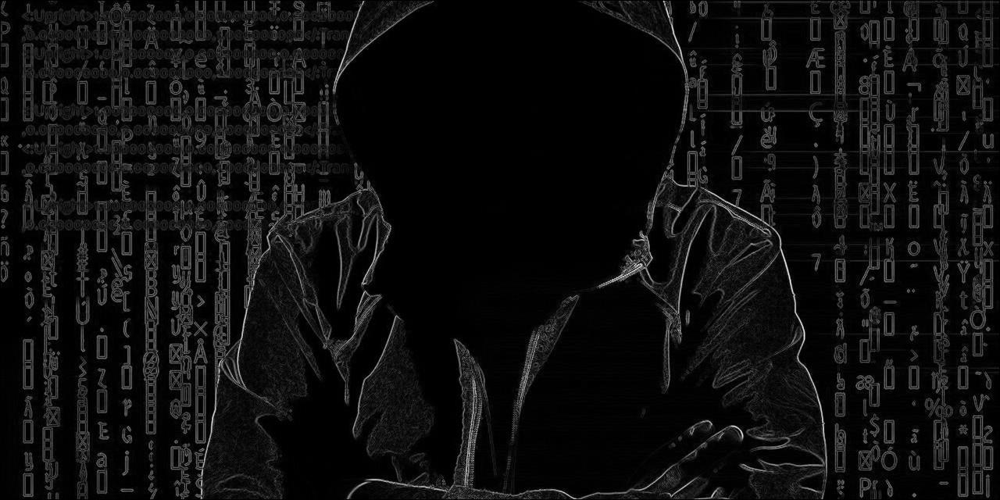
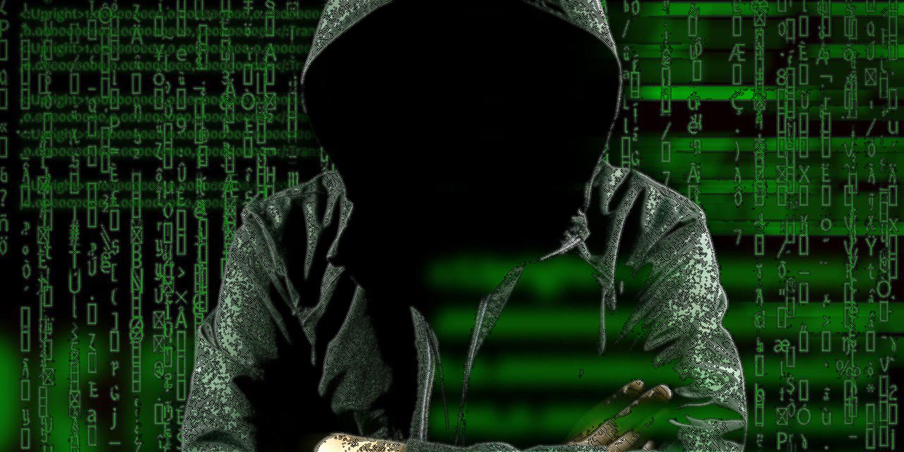

# Pixelator
Basic image processing tools

## Overview and Installation
This Pixelator is a utility which allows you to apply some effects to an image. Think of this as a simpler version of the filters you can apply using Photoshop. The features this Pixelator has includes:

| Command             | Result                                                         |
| ------------------- | -------------------------------------------------------------- |
| (no command)        |  |
| `add-greyscale`     |  |
| `pixelate`          |  |
| `add-edge-contrast` |  |
| `add-cel-shade`     |  |

To install, you need to build this program yourself. If you're running Windows, this can be achieved by running the following commands:

```
cd C:\path\to\dir
javac *.java
```

If you're running Ubuntu or any OS which allows you to run `bash` scripts, you can instead just run the following commands:

```
cd /path/to/dir
./pixel_util
```

## Usage

To execute this pixelator, the following command will work, **regardless of OS**.

```
java Main <command> <input_file> <output_file>
```

If you can run a bash script, you can instead type:

```
./pixel_util <command> <input_file> <output_file>
```

In any case, this utility is used with the following arguments:

- `<command>` governs how you want the image to be processed. A full list of commands includes:
    - `add-greyscale`: Transforms the image to a grayscale form.
    - `pixelate`: Adds pixelation to the image. The pixels are calibrated as `5x5` pixels, meaning this command will average each adjacent `5x5` region to its average color values.
    - `add-edge-contrast`: Detects the lines in which this image's color changes. Internally used to create the borders for the cel-shader, but may be explicitly invoked using this command.
    - `add-cel-shade`: Adds a cel-shading effect onto the image, averaging the color values of each edge-detected region.
- `<input_file>` and `<output_file>` refer to the file which this program will open and file path to which the processed image will be saved, respectively.